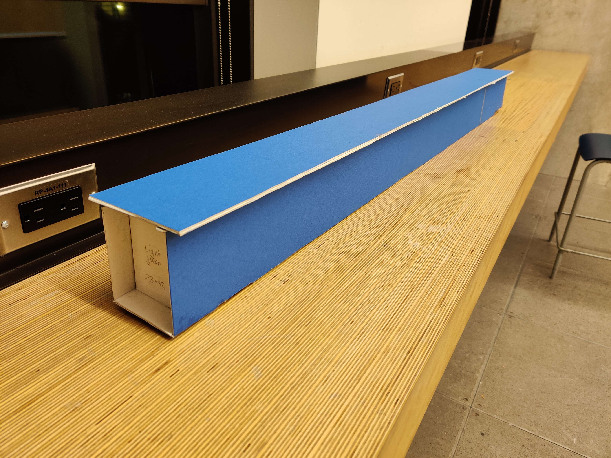
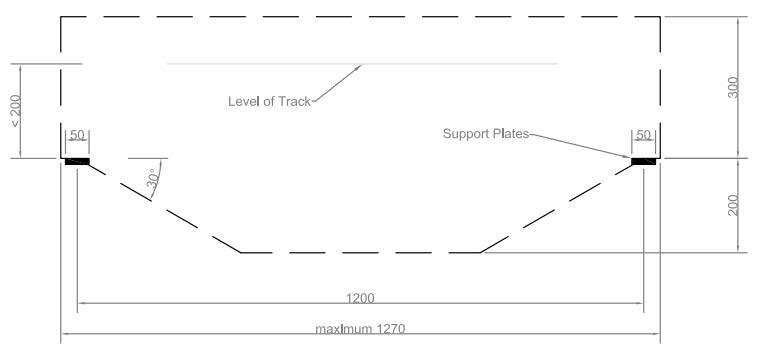
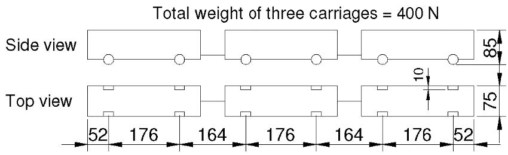
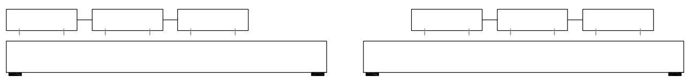
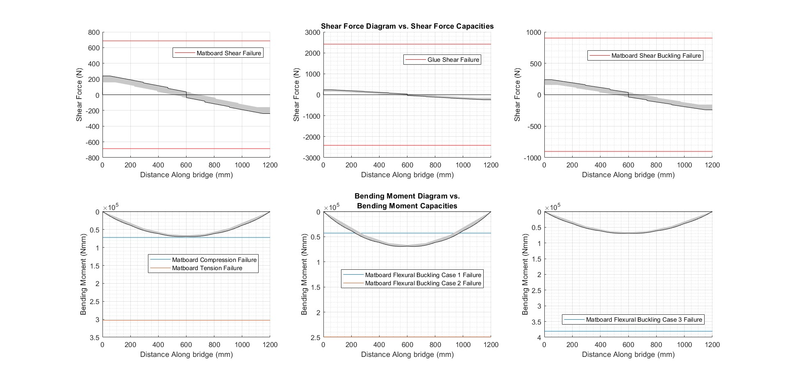
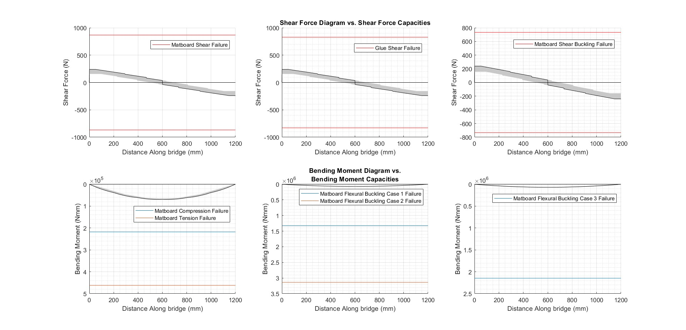

# Matboard Bridge
A small-scale box girder bridge designed in an iterative cross-section design process to withstand a moving load of 1220 N via numerical assessment in MATLAB and fabricated in matboard.

## Design Details
Please find the details of the design decisions, apparatus, and the fabrication process in the [report](docs/report/report.pdf) document.

### Bridge Dimensions [^1]
[^1]: As specified in the assignment outline.

|  |
|:--:|
| *Dimensional constraints outlining the maximum allowed dimensions of the bridge in elevation* |

- The total length of the bridge must be between 1250 and 1270 mm
    - Main span, support center to center distance, 1200 mm + support plates 
- The maximum height of the bridge at the two support locations is 200 mm
- Support locations must contain a flat portion of 50 mm for the bridge to sit on the support plates
- The minimum deck width is 100 mm
    - The deck must be horizontal and permit unhindered passage of the train. There can be no steps or grooves on the top surface for the train wheels to roll over
- Ensure that your bridge design fits in the building envelope shown above

### Bridge Loading [^1]
- A train containing 3 segments will be pushed across your bridge subjecting it to gravity loads
    - The dimensions of the train are shown below
    - The initial weight of the train will be 400N
    - The weight of the train will be progressively increased until bridge failure

||
|:--:|
| *Train dimensions* |

||
|:--:|
| *Loading schematic showing the movement of the train* |

## Computation
Please find the details of the failure hand calculation and code output of [design 0](docs/design-0.pdf) and code output of the final design in the [calculations](docs/calculations/calculations.pdf) document.

### Matlab Script
The MATLAB script [main.m](src/main.m) generates shear force and bending moment capacities for eight principle modes of failure as outlined in [calculation procedure](docs/calculation-procedure.pdf), by considering the cross section at different positions of  the bridge as encapsulated by [cross_section.m](src/cross_section.m)

|  |  |
|:--:|:--:| 
| *Design 0* | *Final design* |

*Subplots depicting the shear force and bending moment capacities to their envelopes as a function of distance along the bridge for design 0 and the final design*

## Team Members
Samuel Chen — report content

Nabeth Ghazi ([nabethg](https://github.com/nabethg)) — programmer/maintainer

Gabriel Lowy

Najma Sultani

## Acknowledgments
This project was part of the [CIV102](https://engineering.calendar.utoronto.ca/course/civ102h1) course offered to first-year [Engineering Science](https://engsci.utoronto.ca/program/what-is-engsci/) students by the [University of Toronto Faculty of Applied Science and Engineering](https://www.engineering.utoronto.ca/).

[Calculations procedure](docs/calculation-procedure.pdf), [design 0](docs/design-0.pdf), and some content in this README document have been derived from the assignment outline.

## License
[GNU General Public License Version 3](LICENSE)
